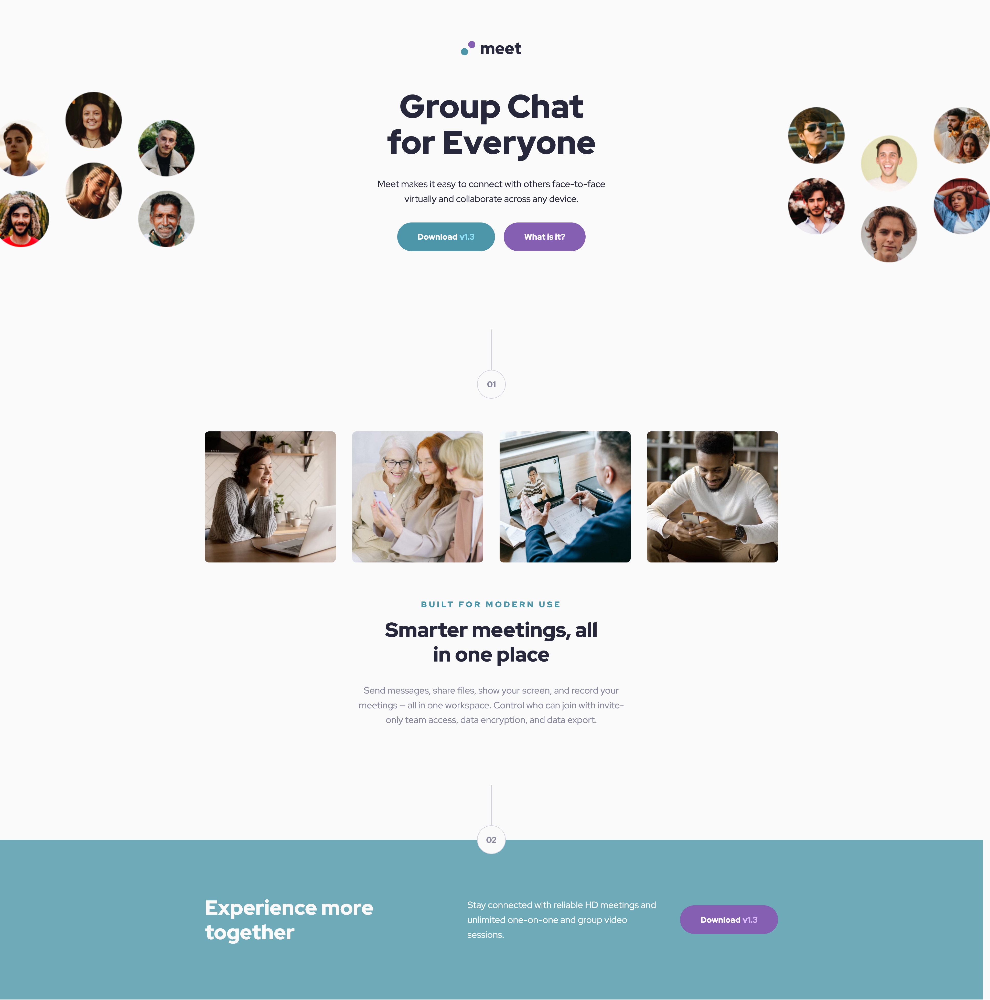
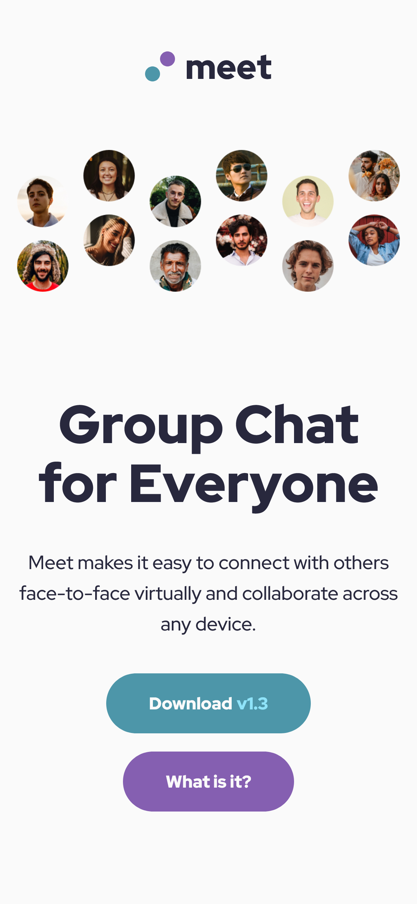

## Meet Landing Page — Frontend Mentor Challenge

A fully responsive landing page built from a high-fidelity design.
Built using semantic HTML5, modern SCSS with design tokens, and a scalable BEM architecture.

[🔗 Live Demo](https://kellenkjames.github.io/meet-landing-page/)

---

## Features

- Responsive design for mobile, tablet, and desktop
- Custom SCSS design system with tokens and utility mixins
- Flexbox layout with intentional breakpoint logic
- Accessible semantic HTML (ARIA + heading structure)
- Optimized imagery using lazy loading and responsive images
- Clean modular structure using BEM + partials
- Built without any UI frameworks or libraries (vanilla HTML + SCSS)

---

## Tech Stack

- HTML5
- SCSS (BEM, Partials, Tokens, Mixins)
- Flexbox & Media Queries
- Git / GitHub
- GitHub Pages (Deployment)
- Figma (Design Reference)

---

## Screenshots

| Desktop                                                 | Mobile                                                |
| ------------------------------------------------------- | ----------------------------------------------------- |
|  |  |

---

## Project Structure

<pre> ``` meet-landing-page/ ├── index.html ├── assets/ │ ├── images/ │ ├── fonts/ │ └── screenshots/ ├── src/ │ └── styles/ │ ├── abstracts/ # Design tokens, mixins, breakpoints │ ├── base/ # Reset + global styles │ ├── components/ # Reusable UI blocks (buttons, images) │ ├── layout/ # Page-level sections (nav, hero, footer) │ └── main.scss # Master SCSS import file ├── style.css # Compiled output └── README.md ``` </pre>

---

## Getting Started

1. Clone the repository:
   `git clone https://github.com/yourusername/meet-landing-page.git`

2. Navigate to the project directory:
   `cd meet-landing-page`

3. Compile SCSS to CSS (if using the CLI):
   `sass src/styles/main.scss style.css`

4. Open `index.html` in your browser to preview the layout.

---

## ⏱️ Time Estimates

| Task                         | Time Spent  |
| ---------------------------- | ----------- |
| Initial Setup & Architecture | 1.5 hrs     |
| SCSS Tokens + Utilities      | 1.5 hrs     |
| Hero + Nav Layout            | 2 hrs       |
| Main Content + Footer        | 2.5 hrs     |
| Responsive & Polish          | 2.5 hrs     |
| Final Refactor & QA          | 2 hrs       |
| **Total**                    | **~12 hrs** |

---

## Key Learnings

- How to structure scalable SCSS architecture
- Implementing design systems with tokens + mixins
- Using `@media` breakpoints with maps and mixins
- Writing clean, semantic, accessible HTML
- Advanced Flexbox layout control using `flex`, `gap`, `transform`, and more
- Making pixel-perfect decisions that mirror real-world frontend workflows

---

## Improvements (If time allowed)

- Add animation transitions to hero and buttons
- Add JS for scroll-triggered transitions
- Modularize the layout further using components
- Consider using `<picture>` element for hero images

---
